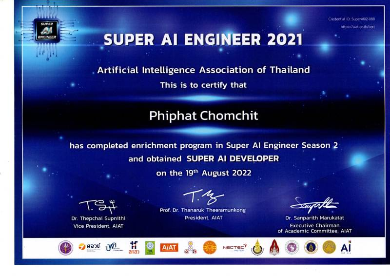
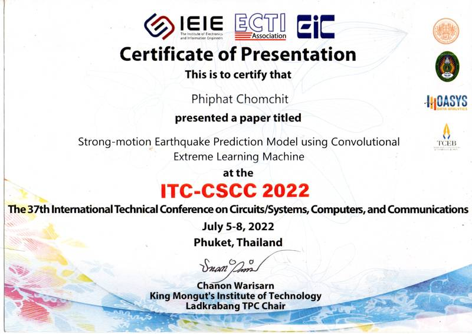
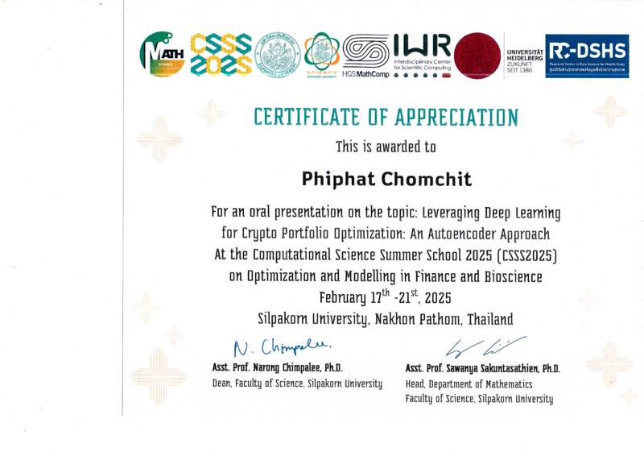
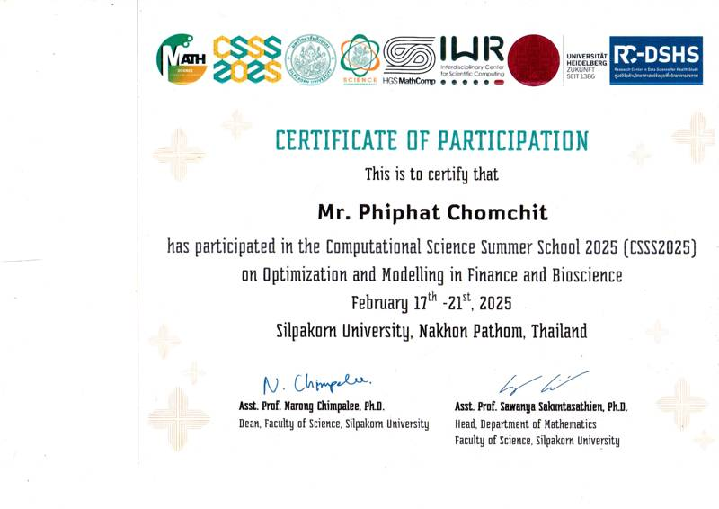

# CV

Name: Mr. Phiphat Chomchit  
Birth date: 27/02/1995  
Location: Chiang Mai, Thailand 
## Contact Information

Email: takezocmu@gmail.com  
Phone number: 0951851163  
GitHub: https://github.com/OrnlyP63  
Medium: https://medium.com/@phiphatchomchit   
Linkedin: https://www.linkedin.com/in/phiphat-chomchit-517b81206/

---
## Profile 
I have been coding in Python and **working with Artificial Intelligence/Machine Learning for five years**. I hold a **bachelor's degree in Mathematics** and a **master's degree in Data Science**. My expertise includes Statistics, Probability Theory, Linear Algebra, Calculus, Partial Differential Equations, and Ordinary Differential Equations, all integrated with Machine Learning applications. I have experience building Machine Learning projects using various frameworks and tools, including NumPy, SciPy, Pandas, Scikit-Learn, PyTorch, TensorFlow, FastAPI, GitHub, and Docker.

My projects primarily focus on improving model training time and reducing resource consumption. I believe that modern Machine Learning needs to be optimized for online streaming data, which demands high computational power and fast training. I have experience writing CUDA C to accelerate model training through parallel processing. Additionally, I research models that require fewer computational resources during the training process. I believe my skills can help you develop Machine Learning solutions that enhance your business.

---
## Work Experience
- AI Engineer Consultant – Synapes Thailand | Remote Freelancer | Jan 2022 – Present
  - Cryptocurrency Portfolio Optimization – Developed optimization models for asset allocation, improving portfolio returns while reducing risk exposure.
  - Route Optimization – Designed AI-driven routing algorithms to minimize logistics costs and enhance operational efficiency.
  - Anomaly Detection using Machine Learning – Built anomaly detection systems for fraud prevention, improving security and reducing financial losses.
  - Churn Rate Analysis on Customer Data – Performed data cleaning and visualization to identify high-risk customers, helping improve retention strategies.
  - Predicting Default Debt Rate in Finance – Developed financial risk models to assess default probability, enabling businesses to manage risk more effectively.
  - Conducted training sessions on Machine Learning, PyTorch, and Reinforcement Learning for AIT Thailand. Designed and delivered hands-on workshops, guiding participants in implementing ML and RL models.
  
---
## Education
- Bachelor’s Degree in Mathematics, Faculty of Science, Chiang Mai University (2014–2018)
- Master’s Degree in Data Science, Department of Engineering, Chiang Mai University (2021–Present)
  
---
## Skills
- Programming Languages: 
  - Python, 
  - Julia, 
  - C, 
  - CUDA C, 
  - NetLogo
- Frameworks & Libraries: 
  - NumPy, 
  - SciPy, 
  - Pandas, 
  - Scikit-Learn, 
  - PyTorch, 
  - TensorFlow, 
  - Z3, 
  - NetworkX, 
  - JupyterLab, 
  - FastAPI
- Tools & Technologies: 
  - Docker, 
  - Git,
  - Streamlit
  - Gradio
- Models & Techniques: 
  - Extreme Learning Machine, 
  - Reservoir Computing, 
  - Reinforcement Learning, 
  - Agent-Based Modeling, 
  - Attention Mechanism, 
  - Transformers, 
  - Dendritic Gated Networks, 
  - Hyperdimensional Computing, 
  - Conformal Prediction, 
  - Extreme Value Theory, 
  - Portfolio Optimization, 
  - Particle Swarm Optimization, 
  - Genetic Algorithm, 
  - Cryptography, 
  - Quantum Computing, 
  - Monte Carlo Simulation

---
## Personal Projects

- My medium blog: I write many articles about Probability theory, Mathemtics and AI
  - Using Extreme Value Theory to analyze the worst scenario in the Crypto Market [link](https://medium.com/@phiphatchomchit/using-extreme-value-theory-to-analyze-the-worst-scenario-in-the-crypto-market-9e9e965b81e0)
  - Trading Strategy Assessment By The Bootstrap Method. [link](https://medium.com/@phiphatchomchit/assessment-trading-strategy-by-the-bootstrap-method-faed8e674208)
  - Fermat Factorization Algorithm can break poor RSA encryption. [link](https://medium.com/@phiphatchomchit/fermat-factorization-algorithm-can-break-poor-rsa-encryption-3c657848cc87)
  - Let’s code Lattice-Based Encryption: The post-quantum encryption. [link](https://medium.com/@phiphatchomchit/lets-code-lattice-based-encryption-the-post-quantum-encryption-6ce613a9e05a)
  - Deep learning in the Matrix [link](https://medium.com/@phiphatchomchit/deep-learning-in-the-matrix-279af3f2a70)
  - Extreme Learning Machine (ELM) is the speed-up learning method for Artificial Neural Network [link](https://medium.com/@phiphatchomchit/extreme-learning-machine-elm-is-the-speed-up-learning-method-for-artificial-neural-network-98ab00dcf617)
  - Let’s deploy your deep learning model with Gradio. [link](https://medium.com/@phiphatchomchit/lets-deploy-your-deep-learning-model-with-gradio-c7e5ceb4122f)
  - etc.
  
- Academic Papers
  - A Product of Two Primes with Difference 2 [link](https://www.tandfonline.com/doi/full/10.1080/00029890.2022.2004850)
- Conferences
  - Strong-motion Earthquake Prediction Model using Convolutional Extreme Learning Machine [link](https://ieeexplore.ieee.org/abstract/document/9894973/)
  - Auto Encoder for Anomaly Detection in the Cryptocurrency Market Using On-Chain Data [link](https://github.com/OrnlyP63/attention-auto-encoder)
- GitHub Project
  - Complexity Sciece Project [link](https://github.com/OrnlyP63/complex-model)
  - Quantum Tutorial [link](https://github.com/OrnlyP63/Quantum_Tutorial)
  - Implement ML using FastAPI [link](https://github.com/OrnlyP63/ml-fastapi)
  - Basic PyTroch Tutorial [link](https://github.com/OrnlyP63/torch)
  - TensorFlow tutorial [link](https://github.com/OrnlyP63/tensorflow-tutorial)
  - Air Pollution Prediction using GNN [link](https://github.com/OrnlyP63/GNN-for-predicting-Airpollution)
  - Genetic Algorithm for Mathematics [link](https://github.com/OrnlyP63/Genetic-programing)
  - Z3 optimization [link](https://github.com/OrnlyP63/Z3)
  - Topic Clusting with LDA [link](https://github.com/OrnlyP63/lda_news_topic_iching)
  - Bird Song Detection using Deep Neural Network [link](https://github.com/OrnlyP63/BirdSongDetection)
  - Time Table Management using GA [link](https://github.com/OrnlyP63/Time-table-manage/tree/master/table)
  
---
## Certifications
- Super AI Engineer Season 2
- Automated Reasoning: satisfiability [link](https://coursera.org/share/0a2a6dc3c8365fa0d29b9e85b532c90a)
- Neural Networks and Deep Learning [link](https://coursera.org/share/7ea0edec6eccd6c1ab0447b90b9ec1c2)
- Biology Meets Programming: Bioinformatics for Beginners [link](https://coursera.org/share/733bc7c90f91a5e06b7061d135265c03)
- Introduction to Agent-Based Modeling [link](https://www.complexityexplorer.org/courses/183-introduction-to-agent-based-modeling/certificates/4226023426)
- Nonlinear Dynamics: Mathematical and Computational Approaches [link](https://www.complexityexplorer.org/courses/184-nonlinear-dynamics-mathematical-and-computational-approaches-2024/certificates/4102291458)
- Introduction to Dynamical Systems and Chaos [link](https://www.complexityexplorer.org/courses/186-introduction-to-dynamical-systems-and-chaos/certificates/4102422530)
- Fractals and Scaling [link](https://www.complexityexplorer.org/courses/187-fractals-and-scaling/certificates/4070047746)

<!-- 
 -->

